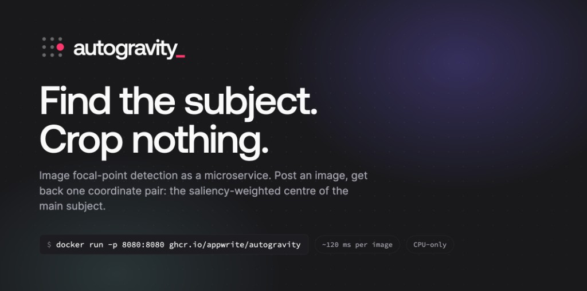

# autogravity

`autogravity` is a small Go HTTP service that finds the best crop focus in an
image. It prioritizes a confidently detected face using YuNet, then falls back
to the weighted centroid of the strongest U²-Net salient region. Results are
normalized X/Y coordinates. It never crops, stores, identifies, or modifies the
submitted image.

## Requirements

- Go 1.25 or newer
- The included INT8 U²-Net model (approximately 42 MiB) and YuNet face detector
  (approximately 230 KiB). `make model` verifies them and downloads/verifies the
  FP32 U²-Net fallback (approximately 168 MiB).
- An ONNX Runtime shared library. Version 1.23.2 is used by the Docker image and
  matches the pinned Go binding.

Download the appropriate ONNX Runtime 1.23.2 archive from the
[official releases](https://github.com/microsoft/onnxruntime/releases/tag/v1.23.2),
extract it, and set `ONNXRUNTIME_LIB` to the full path of its shared library:

```sh
export ONNXRUNTIME_LIB=/absolute/path/to/libonnxruntime.dylib  # macOS
# export ONNXRUNTIME_LIB=/absolute/path/to/libonnxruntime.so   # Linux
```

## Build and run

```sh
make model
make build
./autogravity
```

The server listens on `:8080`. These environment variables are available:

| Variable | Default | Purpose |
| --- | --- | --- |
| `ADDR` | `:8080` | HTTP listen address |
| `MODEL_PRECISION` | `int8` | `int8` or `fp32`, on every architecture |
| `MODEL_PATH` | unset | Explicit model path; overrides `MODEL_PRECISION` |
| `FACE_MODEL_PATH` | `models/face_detection_yunet_2023mar.onnx` | YuNet face-detection model path |
| `FACE_SCORE_THRESHOLD` | `0.85` | Minimum face confidence in `(0.0, 1.0]` |
| `ONNXRUNTIME_LIB` | required | Full ONNX Runtime shared-library path |
| `MAX_CONCURRENT_ANALYSES` | available CPUs | Maximum images decoded and inferred concurrently |
| `ONNX_INTRA_OP_THREADS` | `1` | CPU threads used within each ONNX operator |
| `ANALYSIS_TIMEOUT` | `30s` | Maximum lifetime of an analysis, including upload and queue waits |
| `SHUTDOWN_TIMEOUT` | `30s` | Grace period for active requests during shutdown |

## Performance

INT8 is the default on both amd64 and arm64. Set `MODEL_PRECISION=fp32` to use
FP32, or `MODEL_PATH` for a custom artifact. Unknown precision values fail
startup unless an explicit model path is supplied; there is no silent fallback.
Native runs select `models/u2net-int8.onnx` or `models/u2net.onnx` relative to
the working directory. Containers use the same selection under `/opt`.

On the tested x86 Xeon, INT8 delivered **38–45% more HTTP throughput** at four
CPUs and approximately **64–65% lower peak container memory**. Across 200
held-out public images, median focal-point shift was 0.10%, p95 0.91%, and the
worst shift 7.4% of an image dimension. These throughput gains are not established
for ARM64. The calibration and evaluation provenance is documented with the
model artifact in [models/README.md](models/README.md).

On an Apple M3 Pro, historical **FP32** image analysis takes about **290–390 ms per image** with full U²-Net
and CPU-only ONNX Runtime:

| Input | Dimensions | Time per image |
| --- | --- | --- |
| Landscape JPEG | 1280 × 720 | 391.4 ms |
| Portrait PNG | 720 × 1080 | 291.3 ms |

Measured on September 6, 2026, with macOS 26.5.2 (arm64), 18 GiB RAM, Go 1.25.14,
and ONNX Runtime 1.23.2. Each result is the median of five sequential benchmark
samples using `-benchtime=3s` and the checked-in synthetic images.

These historical timings measure the saliency fallback: decoding, orientation
handling, resizing and normalization to 320 × 320, U²-Net inference, and
focal-point calculation. Face-selected requests skip U²-Net and are typically
substantially faster; every request still pays for the lightweight face check.
Timings exclude model startup, file reads, uploads, and HTTP overhead.
Performance varies with hardware and input images; see
[benchmark instructions](CONTRIBUTING.md#benchmarks) to measure your environment.

By default, the server runs one analysis per effective CPU using one shared
session per model. With Go 1.25, this respects Linux container CPU limits through
the runtime's container-aware `GOMAXPROCS` setting. ONNX Runtime uses one
intra-op thread per analysis, preventing its internal worker pool from
multiplying with request concurrency. Set explicit CPU and memory limits for
predictable resource use, and override `MAX_CONCURRENT_ANALYSES` when memory is
the tighter constraint.

## Docker

The image bundles the verified INT8 and face models and downloads the verified
FP32 model and CPU-only ONNX Runtime during the build. All models are included
on `linux/amd64` and `linux/arm64`; U²-Net precision selection is by
environment, not architecture.

```sh
docker build -t autogravity .
docker run --rm -p 8080:8080 autogravity
# Select FP32 without rebuilding:
docker run --rm -p 8080:8080 -e MODEL_PRECISION=fp32 autogravity
```

### Container releases

Publishing a GitHub Release with a semantic version tag such as `v1.2.3`
builds and pushes a multi-architecture image to GitHub Container Registry:

```text
ghcr.io/appwrite/autogravity:1.2.3
ghcr.io/appwrite/autogravity:1.2
ghcr.io/appwrite/autogravity:1
ghcr.io/appwrite/autogravity:latest
```

Prereleases receive only their full version tag and do not update `latest`.
Published images include build provenance and an SBOM.

## API

Liveness and readiness checks:

```sh
curl -sS http://localhost:8080/livez
curl -sS http://localhost:8080/readyz
```

```json
{
  "status": "ok"
}
```

`/livez` reports that the process is running. `/readyz` reports whether the
service is accepting analyses and returns 503 as soon as graceful shutdown
starts. `/healthz` remains a compatibility alias for `/readyz`.

Send a JPEG, PNG, or WebP image as a multipart `image` field:

```sh
curl -sS -X POST http://localhost:8080/analyze \
  -F 'image=@photo.jpg'
```

Or send the image as the raw request body:

```sh
curl -sS -X POST http://localhost:8080/analyze \
  -H 'Content-Type: image/jpeg' \
  --data-binary '@photo.jpg'
```

Example response:

```json
{
  "gravity": {
    "x": 0.68,
    "y": 0.37
  },
  "confidence": 0.91,
  "source": "face"
}
```

Coordinates are in `[0.0, 1.0]`, measured from the oriented image's top-left
corner. EXIF orientation is applied before analysis. A YuNet face at or above
the configured score threshold has priority, with the most prominent face's
bounding-box center supplying the focal point. If no reliable face is found,
the image is fitted within U²-Net's 320x320 input using neutral padding, without
stretching or cropping. Padding is excluded from the calculation. Pixels
reaching at least half the peak activation are grouped into connected regions,
and the region with the greatest total saliency supplies the fallback point.

`source` is `face` or `saliency`. `confidence` is the selected model's score:
YuNet's face score for `face`, or the peak fused-map activation for `saliency`.
Scores are clamped to `[0.0, 1.0]` but are not calibrated probabilities and
should not be compared across sources. Face detection does not perform identity
recognition. Blurred, obscured, or highly stylized faces may use the saliency
fallback.

Requests are limited to 10 MiB and decoded images to 20 megapixels. Separate
upload and analysis admission limits bound buffered-body and decoded-image
memory without allowing slow uploads to reserve inference capacity. Both models
are loaded once at startup and their inference sessions are reused safely
across requests.

## Telemetry and shutdown

The service writes structured JSON logs to stdout. Each HTTP request receives
an `X-Request-ID`; a caller-supplied ID is retained when it contains only ASCII
letters, digits, `_`, or `-` and is at most 64 characters. Logs never include
uploaded image data, filenames, query strings, or request headers.

Prometheus metrics are exposed at `/metrics`, including HTTP rates and latency,
pipeline stage latency, face-detection outcomes, selected gravity sources,
active inference count, cancellations, Go runtime statistics, process
statistics, and build information. Keep this endpoint private at the ingress
layer.

Every analysis has a configurable deadline. Cancellation propagates into ONNX
Runtime and terminates that request's native inference without affecting other
concurrent requests. On SIGINT or SIGTERM, readiness becomes false immediately,
new analyses receive 503 with `Retry-After`, and active requests may finish for
`SHUTDOWN_TIMEOUT`. Once the grace period expires, their contexts are cancelled,
native inference is terminated, connections are closed, and the model sessions
are then released. Set the orchestrator termination grace period longer than
`SHUTDOWN_TIMEOUT`.

## Model quality

YuNet prioritizes clear faces but intentionally falls back when its confidence
is below the configured threshold. Full U²-Net fixes the person-in-room fixture
previously missed by U²-NetP, but still misses two difficult scenes. See the
[fixture evaluation](internal/testimages/testdata/README.md) for measured outputs
and unchanged expected regions.

## Contributing

See [CONTRIBUTING.md](CONTRIBUTING.md) for development setup, tests, quality
evaluation, benchmark reproduction, and the project layout.
