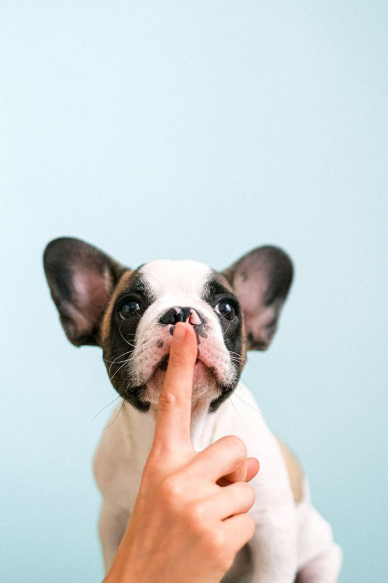
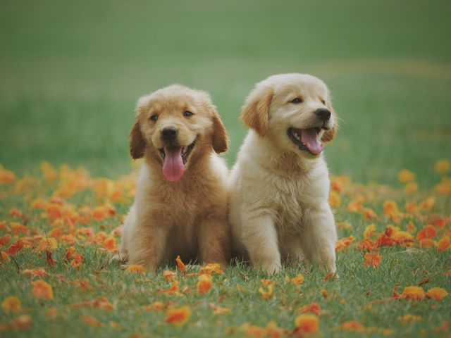
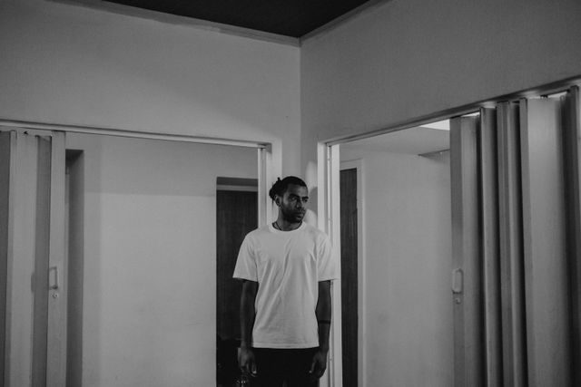
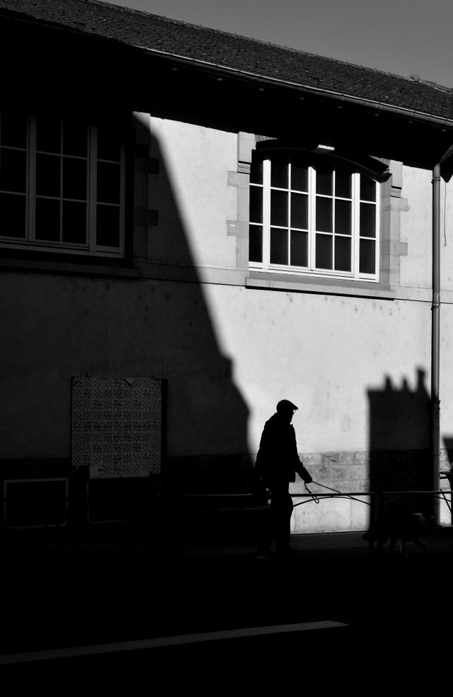
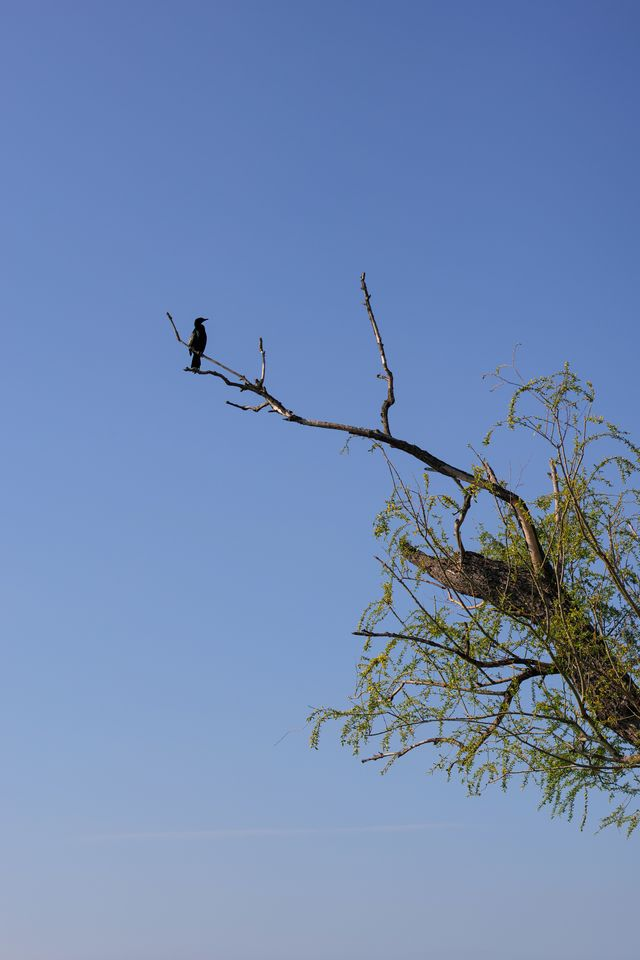
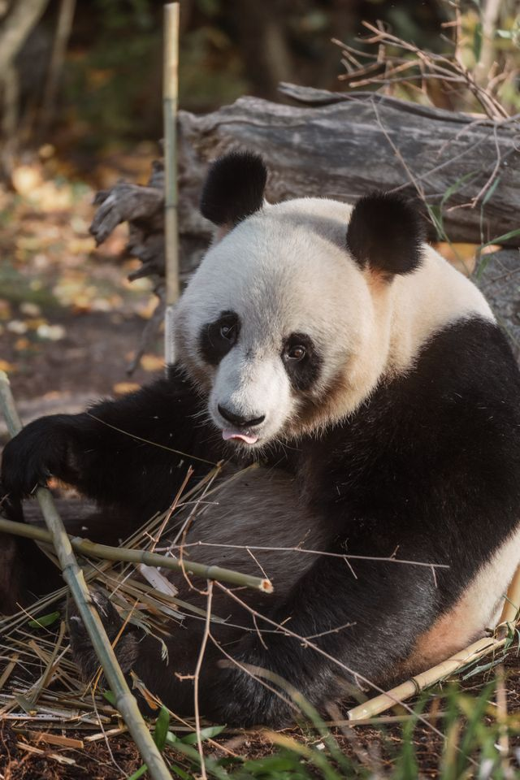

# Image fixtures

The five format fixtures below are copied unchanged from `golang.org/x/image` v0.45.0,
`testdata/`. The upstream BSD license is included in `LICENSE`.

| Local name | Upstream name | Purpose |
| --- | --- | --- |
| rose.png | yellow_rose.png | Landscape flower photograph, PNG with transparency |
| rose-lossless.webp | yellow_rose.lossless.webp | Lossless WebP of the flower |
| rose-lossy.webp | yellow_rose.lossy.webp | Lossy WebP of the flower |
| rose-alpha.webp | yellow_rose.lossy-with-alpha.webp | Lossy WebP with alpha |
| portrait.jpg | go-turns-two-280x360.jpeg | Portrait photograph of a Go plush toy |

Source: https://go.googlesource.com/image/+/refs/tags/v0.45.0/testdata/

Tests read these fixtures locally and require no downloads. EXIF tests inject
orientation metadata into the JPEG without re-encoding its pixels. Model tests
use broad subject regions and transformation consistency, rather than exact
floating-point snapshots, to tolerate runtime and architecture differences.

## Natural-scene autogravity cases

These five additional photographs are downloaded at 640 pixels wide from Pexels,
with the original composition preserved (no cropping or subject repositioning).
They are covered by the [Pexels License](https://www.pexels.com/license/), not the
Go BSD license above. Retrieved 2026-09-06. Original photo pages are linked below;
the exact download URL is `https://images.pexels.com/photos/ID/pexels-photo-ID.jpeg?w=640`.

Expected regions were chosen by visually inspecting the subject **before** running
inference. They describe acceptable saliency centroids, not pixel segmentation
masks or ground-truth face locations. Coordinates are normalized to the original
image. With multiple subjects, the centroid can fall between them.

| Preview | Source | Expected region (x; y) | Purpose |
| --- | --- | --- | --- |
|  | [Dog portrait, Pexels 4587991](https://www.pexels.com/photo/4587991/) | 0.25–0.75; 0.58–0.85 | Strong vertical displacement; center fallback fails |
|  | [Two puppies, Chevanon Photography](https://www.pexels.com/photo/two-yellow-labrador-retriever-puppies-1108099/) | 0.30–0.70; 0.35–0.75 | Multiple foreground subjects against textured grass |
|  | [Person in room, cottonbro studio](https://www.pexels.com/photo/grayscale-photo-of-a-man-6756350/) | 0.40–0.58; 0.55–0.90 | Person versus architectural background; passes with full U²-Net |
|  | [Pedestrian and dog, Alexis B](https://www.pexels.com/photo/silhouette-of-a-man-walking-dog-in-urban-shadow-37197025/) | 0.55–0.94; 0.57–0.80 | Off-center subjects, shadows, busy background; known miss |
|  | [Bird on branch, Sena](https://www.pexels.com/photo/bird-perched-on-lone-tree-branch-against-clear-sky-32546254/) | 0.27–0.34; 0.32–0.40 | Small subject versus foliage; known miss |

`make test-integration` checks the first two scenes and the existing format
fixtures, including raw/multipart equivalence and horizontally reflected subject
regions. Reflection consistency allows 7.5% displacement because inference is
not exactly reflection invariant.

`make evaluate` runs the last three scenes against the same manually specified
expectations. **It currently exits nonzero** with full U²-Net and ONNX Runtime
1.23.2; the person-in-room case passes, while the other two still fail. These
failures are retained without widening the expected subject regions.

Observed original-image outputs on macOS arm64 with ONNX Runtime 1.23.2:

| Scene | U²-NetP x, y | Full U²-Net x, y | Full model peak activation | Full model finding |
| --- | --- | --- | --- | --- |
| Person in room | 0.6944, 0.6352 | 0.4859, 0.7586 | 1.0000 | Passes original and mirrored subject checks |
| Pedestrian and dog | 0.2572, 0.4904 | 0.6766, 0.5457 | 0.9808 | Above expected region; reflection checks also fail |
| Bird on branch | 0.5443, 0.6420 | 0.4112, 0.3939 | 0.9981 | Right of bird; reflected region also fails |

Peak activation is the API's current `confidence` value; these examples show it
is not a calibrated probability that the selected subject is correct.

## Panda regression

`panda-bamboo.jpg` was added after a similar user-supplied image exposed a model
failure. The original Getty-referenced attachment is not redistributed. This
replacement is downloaded at 640 pixels wide from Pexels and covered by the
[Pexels License](https://www.pexels.com/license/).

| Preview | Expected region (x; y) | Purpose |
| --- | --- | --- |
|  | 0.20–0.80; 0.25–0.85 | [Panda eating bamboo, Ahmet Yüksek](https://www.pexels.com/photo/giant-panda-eating-bamboo-in-natural-habitat-35438771/); panda versus logs and bamboo |

The expected region was chosen visually before inference and covers the panda's
body rather than just its face. `make test-integration` checks this fixture's
subject location, confidence, raw/multipart equivalence, and horizontal reflection
using the same tolerances as the other regression images.

Full U²-Net with ONNX Runtime 1.23.2 on macOS arm64 passes all of these checks:
the original-image centroid is (0.5857, 0.6570), with peak activation 1.0000.
